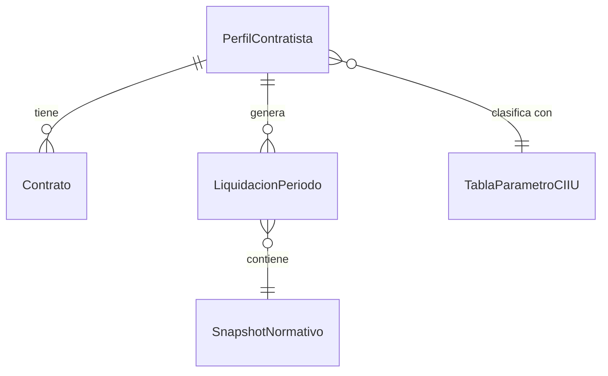

# Modelo de Datos — Motor de Cumplimiento Colombia

## Entidades del Dominio

### PerfilContratista
Datos de identidad y afiliación del contratista independiente.

| Campo | Tipo | Restricción | Ref. |
|---|---|---|---|
| `id` | UUID | PK | |
| `tipo_documento` | ENUM(CC, CE, PEP) | NOT NULL | RF-01 |
| `numero_documento` | VARCHAR(20) | UNIQUE, NOT NULL | RF-01 |
| `nombre_completo` | VARCHAR(200) | NOT NULL | RF-01 |
| `eps_id` | FK → EntidadSGSSI | NOT NULL | RF-01 |
| `afp_id` | FK → EntidadSGSSI | NOT NULL | RF-01 |
| `ciiu_codigo` | FK → TablaParametroCIIU | NOT NULL | RF-01, RN-02 |
| `estado` | ENUM(ACTIVO, INACTIVO) | NOT NULL | RF-01 |
| `created_at` | TIMESTAMP | NOT NULL | |

---

### Contrato
Contrato de prestación de servicios de un contratista.

| Campo | Tipo | Restricción | Ref. |
|---|---|---|---|
| `id` | UUID | PK | |
| `contratista_id` | FK → PerfilContratista | NOT NULL | RF-02 |
| `entidad_contratante` | VARCHAR(200) | NOT NULL | RF-02 |
| `valor_bruto_mensual` | DECIMAL(18,4) | > 0, NOT NULL | RF-02, INV-01 |
| `nivel_arl` | ENUM(I, II, III, IV, V) | NOT NULL | RF-02, RN-08 |
| `fecha_inicio` | DATE | NOT NULL | RF-02 |
| `fecha_fin` | DATE | NOT NULL, ≥ fecha_inicio | RF-02 |
| `estado` | ENUM(BORRADOR, ACTIVO, FINALIZADO) | NOT NULL | P2 |

---

### LiquidacionPeriodo
Registro inmutable de una liquidación mensual. NO se puede eliminar ni modificar.

| Campo | Tipo | Restricción | Ref. |
|---|---|---|---|
| `id` | UUID | PK | |
| `contratista_id` | FK → PerfilContratista | NOT NULL | P3..P8 |
| `periodo` | CHAR(7) — YYYY-MM | NOT NULL | P3 |
| `ingreso_bruto_total` | DECIMAL(18,4) | NOT NULL | RF-03 |
| `costos_presuntos` | DECIMAL(18,4) | NOT NULL | RF-04, RN-02 |
| `ibc` | DECIMAL(18,4) | NOT NULL, [1 SMMLV, 25 SMMLV] | RF-04, RN-01 |
| `aporte_salud` | DECIMAL(18,2) | NOT NULL | RF-06, RN-03 |
| `aporte_pension` | DECIMAL(18,2) | NOT NULL | RF-06, RN-03 |
| `aporte_arl` | DECIMAL(18,2) | NOT NULL | RF-06, RN-03 |
| `nivel_arl_aplicado` | ENUM(I,II,III,IV,V) | NOT NULL | RN-08 |
| `retencion_fuente` | DECIMAL(18,2) | NOT NULL | RF-07, RN-07 |
| `base_gravable_retencion` | DECIMAL(18,4) | NOT NULL | CT-03 |
| `opcion_piso_proteccion` | ENUM(BEPS, SMMLV_COMPLETO, NO_APLICA) | NOT NULL | RF-05, RN-06 |
| `snapshot_normativo_id` | FK → SnapshotNormativo | NOT NULL | RES-C03 |
| `generado_en` | TIMESTAMP | NOT NULL | P8 |

> ⚠️ Esta tabla es **APPEND-ONLY**. Las filas son inmutables después de su creación.

---

### SnapshotNormativo
Foto de los parámetros legales vigentes en el momento de la liquidación.

| Campo | Tipo | Restricción | Ref. |
|---|---|---|---|
| `id` | UUID | PK | |
| `smmlv` | DECIMAL(18,2) | NOT NULL | RES-D02 |
| `uvt` | DECIMAL(18,2) | NOT NULL | RES-T03 |
| `pct_salud` | DECIMAL(6,4) — 0.1250 | NOT NULL | RES-N02 |
| `pct_pension` | DECIMAL(6,4) — 0.1600 | NOT NULL | RES-N02 |
| `tabla_arl` | JSON | NOT NULL | RES-D03 |
| `vigencia_anio` | INTEGER | NOT NULL | |
| `created_at` | TIMESTAMP | NOT NULL | |

---

### TablaParametroCIIU
Tabla de costos presuntos por actividad económica (Resolución DIAN 209/2020).

| Campo | Tipo | Restricción | Ref. |
|---|---|---|---|
| `codigo_ciiu` | VARCHAR(10) | PK | RES-D01 |
| `descripcion` | VARCHAR(500) | NOT NULL | |
| `pct_costos_presuntos` | DECIMAL(6,4) | NOT NULL, [0..1] | RN-02 |
| `vigente_desde` | DATE | NOT NULL | RES-D01 |

---

### TablaRetencion383
Tabla del Artículo 383 del Estatuto Tributario (rangos en UVT).

| Campo | Tipo | Restricción | Ref. |
|---|---|---|---|
| `id` | INTEGER | PK | |
| `uvt_desde` | DECIMAL(10,2) | NOT NULL | Art. 383 E.T. |
| `uvt_hasta` | DECIMAL(10,2) | NULL (último rango) | |
| `tarifa_marginal` | DECIMAL(6,4) | NOT NULL | |
| `uvt_deduccion` | DECIMAL(10,2) | NOT NULL | |
| `vigente_desde` | DATE | NOT NULL | RES-T02 |

---

## Diagrama de Relaciones

