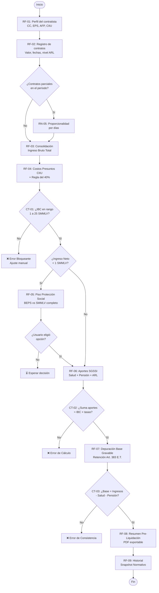
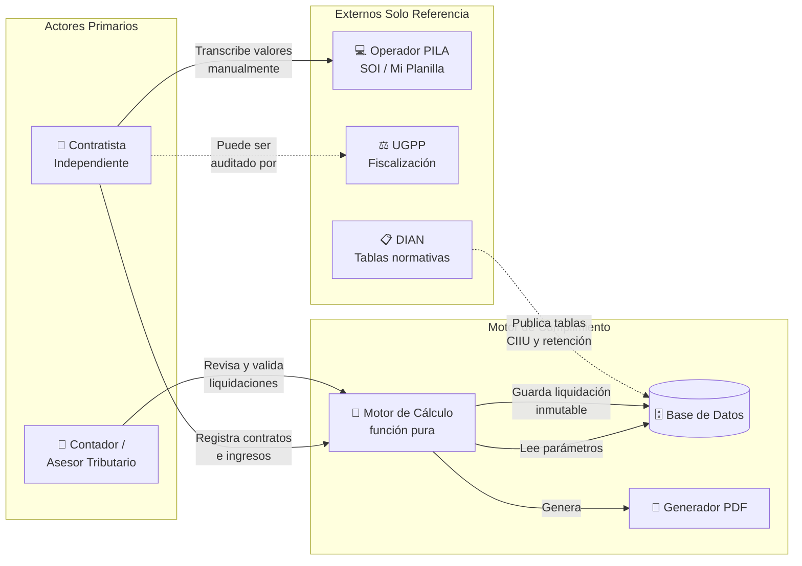
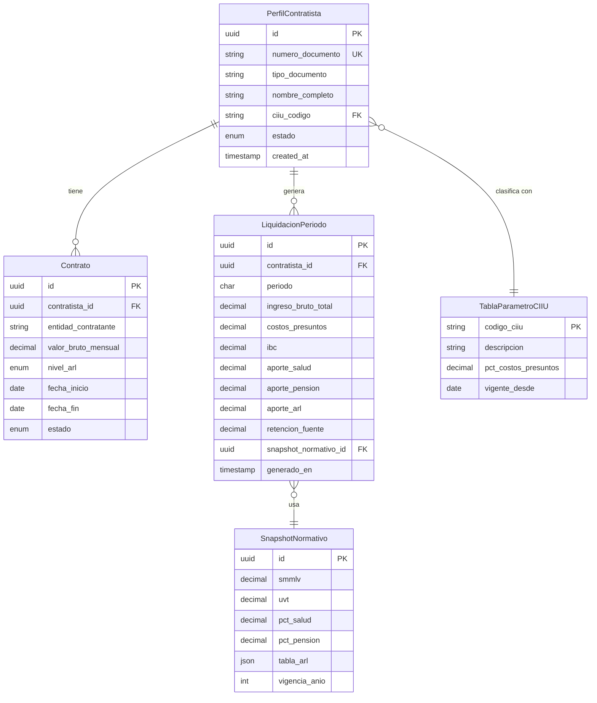
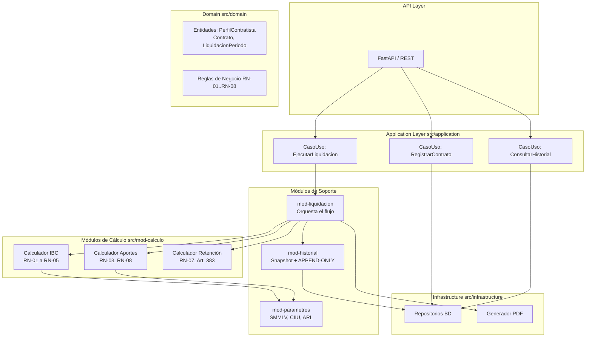
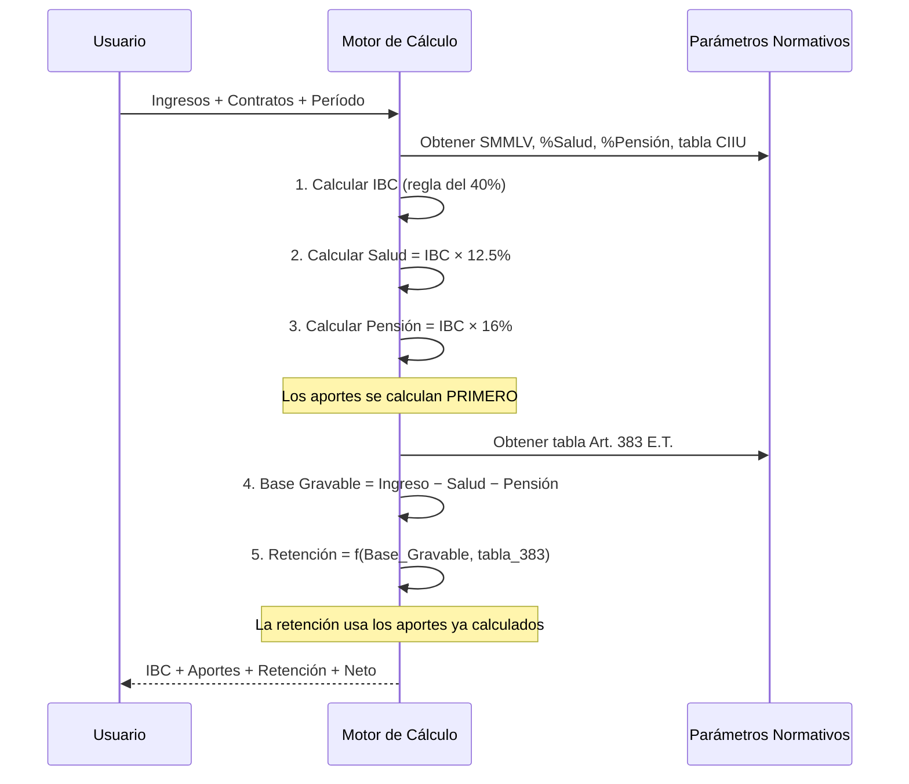

# Diagramas del Sistema
**Motor de Cumplimiento — Colombia**

*Todos los diagramas están en formato Mermaid. Renderizables en GitHub, VS Code y Google Antigravity.*

---

## Diagrama 1 — Flujo Principal de Liquidación Mensual

---

## Diagrama 2 — Actores y sus Interacciones

---

## Diagrama 3 — Modelo de Dominio (Entidades Principales)

---

## Diagrama 4 — Arquitectura de Módulos (src/)

---

## Diagrama 5 — Dependencia Circular Resuelta (Aportes → Retención)

