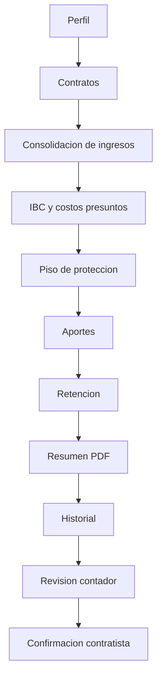
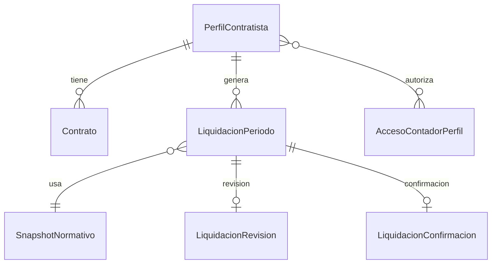

# Diagramas

## Flujo principal

```mermaid
flowchart TD
    A[Perfil] --> B[Contratos]
    B --> C[Consolidacion de ingresos]
    C --> D[IBC y costos presuntos]
    D --> E[Piso de proteccion]
    E --> F[Aportes]
    F --> G[Retencion]
    G --> H[Resumen PDF]
    H --> I[Historial]
    I --> J[Revision contador]
    J --> K[Confirmacion contratista]
```

## Relaciones del dominio

```mermaid
erDiagram
    PerfilContratista ||--o{ Contrato : tiene
    PerfilContratista ||--o{ LiquidacionPeriodo : genera
    LiquidacionPeriodo }o--|| SnapshotNormativo : usa
    PerfilContratista }o--o{ AccesoContadorPerfil : autoriza
    LiquidacionPeriodo ||--o| LiquidacionRevision : revision
    LiquidacionPeriodo ||--o| LiquidacionConfirmacion : confirmacion
```
