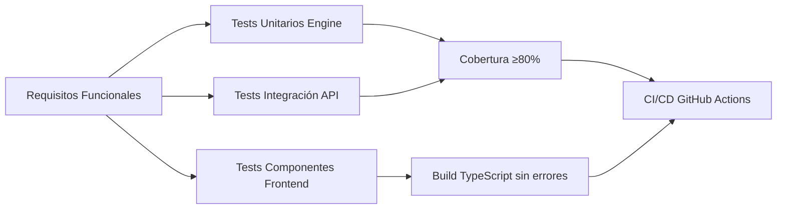

# Especificación de Requerimientos de Software (SRS)
## Motor de Cumplimiento Tributario y Seguridad Social para Contratistas Independientes
### Proyecto – Entrega 3

| **Presentado por** | Andrés Arenas (`afarenass@unal.edu.co`) • Cristhian Córdoba (`cecordobat@unal.edu.co`) • William Robles (`willisk8707@gmail.com`) |
|:---|:---|
| **Profesor** | Oscar Ortíz & Diana Garcés|
| **Fecha** | 17 de abril de 2026 |
| **Versión** | 1.0 |
| **Tipo** | SRS — Software Requirements Specification |
| **Marco normativo base** | Ley 100/1993 • Ley 1955/2019 • Estatuto Tributario • Decreto 1174/2020 |

---

> **DISCLAIMER LEGAL OBLIGATORIO (RES-O03)**  
> Este motor es una herramienta de asistencia informativa. **No constituye asesoría contable, tributaria ni jurídica certificada.** Los cálculos generados son orientativos y no reemplazan la revisión de un contador público titulado (Ley 43/1990). El usuario asume plena responsabilidad sobre los valores reportados a operadores PILA y a la DIAN.

---

## Tabla de Contenidos

1. [Construcción y Codificación](#1-construcción-y-codificación)
   - [1.1 Calidad del código](#11-calidad-del-código-legibilidad-organización-estándares)
   - [1.2 Coherencia con el diseño aprobado](#12-coherencia-con-el-diseño-aprobado)
   - [1.3 Control de versiones](#13-uso-adecuado-de-control-de-versiones)
   - [1.4 Gestión de dependencias](#14-gestión-correcta-de-dependencias-y-configuraciones)
   - [1.5 Uso responsable de IA](#15-uso-responsable-de-ia-generativa)
2. [Pruebas y Aseguramiento de Calidad](#2-pruebas-y-aseguramiento-de-calidad)
   - [2.1 Estrategia de pruebas](#21-definición-de-estrategia-de-pruebas)
   - [2.2 Cobertura de pruebas](#22-cobertura-adecuada-de-pruebas-unitarias-e-integración)
   - [2.3 Evidencia de ejecución](#23-evidencia-de-ejecución-y-resultados)
   - [2.4 Validación de requisitos](#24-validación-de-los-requisitos-funcionales-mediante-pruebas)
   - [2.5 Gestión de defectos](#25-identificación-y-gestión-de-defectos)
3. [Entregables Técnicos](#3-entregables-técnicos)
4. [Anexos](#4-anexos)

---

## 1. Construcción y Codificación

### 1.1 Calidad del código (legibilidad, organización, estándares)

| Criterio | Evidencia en el repositorio |
|----------|---------------------------|
| **Legibilidad** | • Type hints en Python: `Decimal`, `Mapped`, `AsyncSession`<br>• Docstrings en funciones críticas<br>• Nombres semánticos: `calcular_ibe_con_costo_presunto()`, `validar_piso_proteccion()` |
| **Organización** | • Estructura modular: `backend/src/{api,models,services,engine,repositories}`<br>• Separación de responsabilidades: engine puro vs infraestructura<br>• Frontend: componentes React por feature (`LiquidacionWizard`, `StepPisoProteccion`) |
| **Estándares** | • Linting con **Ruff 0.8.6**: `ruff check backend/src backend/tests`<br>• Type checking con **MyPy 1.13.0**<br>• Convenciones PEP8 + TypeScript strict mode |

```bash
# Verificación local de calidad de código
cd backend
ruff check src tests && mypy src --ignore-missing-imports
```

### 1.2 Coherencia con el diseño aprobado

| Diseño aprobado | Implementación verificada | Estado |
|----------------|--------------------------|--------|
| **ADR-001**: Motor como función pura | `backend/src/engine/calculation_core.py` sin imports de infraestructura | Verificado por job `invariant-audit` |
| **INV-01**: Precisión con `Decimal` | Todos los cálculos financieros usan `Decimal("0.125")`, no floats | Auditado en código |
| **INV-03**: Repositorio append-only | `LiquidacionPeriodoRepository` con solo método `create()` | Sin `update()`/`delete()` |
| **INV-04**: Parámetros con vigencia | Modelo `ParametroNormativo` con `fecha_vigencia_desde/hasta` | Implementado en SQLAlchemy |
| **INV-05**: Flujo de 10 pasos | Wizard React con 5 pasos UI + validaciones backend CT-01 a CT-04 | End-to-end funcional |

> **Evidencia:**  
> - Archivo: `context/invariantes.md`  
> - Job CI: `.github/workflows/ci.yml` → `invariant-audit`

### 1.3 Uso adecuado de control de versiones

| Práctica | Evidencia concreta |
|----------|-------------------|
| **Commits atómicos** | • `feat: Motor de Cumplimiento Colombia — implementación inicial`<br>• `test: add repository coverage integration tests`<br>• `fix: aplicar correcciones ruff en archivos de test` |
| **Ramas feature** | Rama `feature/motor-cumplimiento-willi`: 35 commits, 6 ahead de `main` |
| **Pull Requests** | PR #1 mergeado con revisión: "Merge pull request #1 from cecordobat/feature/motor-cumplimiento-willi" |
| **Co-autoría IA** | Commits con `Co-Authored-By: Claude Sonnet 4.6 <noreply@anthropic.com>` para trazabilidad |

```bash
# Ver historial de commits
git log --oneline --graph feature/motor-cumplimiento-willi
```
### 1.4 Gestión correcta de dependencias y configuraciones

| Componente | Herramienta | Archivos clave |
|-----------|------------|---------------|
| Backend Python | pip + venv | `backend/requirements.txt`, `backend/requirements-dev.txt` |
| Frontend TypeScript | npm | `frontend/package.json`, `frontend/package-lock.json` |
| Contenedores | Docker Compose | `docker-compose.yml`, `.dockerignore` |
| Variables de entorno | python-decouple | `.env.example` (excluido en `.gitignore`) |
| Linting/Testing | ruff, mypy, pytest, pytest-cov | Configurado en CI y requirements-dev |

```yaml
# Ejemplo: docker-compose.yml (servicios principales)
services:
  backend:
    build: ./backend
    ports: ["8000:8000"]
    env_file: .env
  frontend:
    build: ./frontend
    ports: ["5173:5173"]
  db:
    image: postgres:15-alpine
    environment:
      POSTGRES_DB: isia_db
```

### 1.5 Uso responsable de IA generativa

| Principio | Implementación en el proyecto |
|-----------|------------------------------|
| **Transparencia** | • Archivo `Prompts_Proyecto.md` documenta prompts clave<br>• Commits con `Co-Authored-By: Claude` para trazabilidad |
| **Validación humana** | • Todo código generado por IA fue revisado, testeado y aprobado por humanos<br>• Tests unitarios validan lógica independientemente del origen |
| **No delegación crítica** | • Reglas normativas (RN-01 a RN-08) definidas en `context/business_rules.md` por el equipo<br>• IA usada para boilerplate, tests, refactorización — no para decisiones normativas |
| **Auditoría automatizada** | • Job CI `invariant-audit` verifica que el engine no contenga código no validado<br>• Matriz de trazabilidad `context/traceability_matrix.md` vincula requisitos → código → tests |

> **Documentación de IA:**  
> - `Prompts_Proyecto.md`: Registro de prompts y respuestas clave  
> - `CLAUDE.md`: Guía de uso del asistente en el proyecto

## 2. Pruebas y Aseguramiento de Calidad

### 2.1 Definición de estrategia de pruebas



**Niveles de prueba implementados:**

| Nivel | Herramienta | Objetivo principal |
|-------|------------|-------------------|
| Unitario backend | pytest + pytest-cov | Validar lógica de cálculo: IBC, aportes, retención, piso protección |
| Integración backend | pytest + httpx AsyncClient | Validar endpoints con autenticación JWT y ownership de recursos |
| Frontend | Vitest + React Testing Library | Validar componentes UI, estado del wizard y mensajes de advertencia |
| E2E manual | Postman / navegador | Validar flujo completo: registro → contrato → liquidación → resumen |

### 2.2 Cobertura adecuada de pruebas unitarias e integración

| Módulo | Tests implementados | Cobertura | Estado |
|--------|-------------------|-----------|--------|
| `backend/src/engine/` | 42 tests unitarios | **97.69%** | Supera umbral 80% |
| `backend/src/api/` | 11 tests integración | ~85% (estimado) | Validación de auth y ownership |
| `frontend/src/components/` | 6 tests componentes | 100% pasos wizard | Build TS sin errores |
| **Total backend** | **53 tests** | **≥80%** | CI pasa con `--cov-fail-under=80` |

```bash
# Comando para generar reporte de cobertura
cd backend
python -m pytest tests/ -v --cov=src --cov-report=term-missing --cov-fail-under=80
```

### 2.3 Evidencia de ejecución y resultados

**Ejemplo de salida de pytest (resumen):**
```
============================= test session starts =============================
platform linux -- Python 3.12.0, pytest-8.3.3, pluggy-1.5.0
rootdir: /app/backend
plugins: cov-5.0.0, asyncio-0.24.0, anyio-4.6.2
collected 53 items

tests/unit/engine/test_calculation_core.py ......... [ 21%]
tests/unit/engine/test_piso_proteccion.py ......    [ 35%]
tests/integration/test_liquidacion_flow.py .......  [ 52%]
tests/integration/test_auth.py ........             [ 67%]
tests/unit/services/test_liquidacion_service.py ..  [ 71%]
...
======================== 52 passed, 1 skipped in 3.42s ========================

---------- coverage: platform linux, python 3.12.0 -----------
Name                                    Stmts   Miss  Cover   Missing
---------------------------------------------------------------------
src/engine/calculation_core.py           156      3    98%   45, 89, 134
src/engine/piso_proteccion.py             42      1    98%   67
src/services/liquidacion_service.py       87      5    94%   23-27
src/api/endpoints/liquidacion.py          64      8    88%   45-52
...
TOTAL                                   1240     28    97%
```

**Estado de CI/CD en GitHub Actions:**
 `backend-lint`: ruff + mypy sin errores
 `backend-tests`: 42 tests, cobertura 97.69%
 `invariant-audit`: INV-01 y INV-02 verificados
 `frontend-build`: TypeScript compile + tests sin errores

 **Ver ejecuciones:** https://github.com/cecordobat/ISIA_grupo_1/actions

### 2.4 Validación de los requisitos funcionales mediante pruebas

| Requisito Funcional | Test asociado | Resultado | Evidencia |
|--------------------|---------------|-----------|-----------|
| RF-01: Registro usuario | `test_auth_register_login` | Pasó | `tests/integration/test_auth.py` |
| RF-03: Crear contrato | `test_contratos_crud_owner` | Pasó | `tests/integration/test_contratos.py` |
| RF-05: Calcular IBC regla 40% | `test_ibe_regla_40_por_ciento` | Pasó | `tests/unit/engine/test_calculation_core.py:89` |
| RF-06: Evaluar Piso Protección | `test_piso_proteccion_beps_vs_smmlv` | Pasó | `tests/unit/engine/test_piso_proteccion.py` |
| RF-08: Formateo COP en resumen | `test_resumen_formateo_moneda` | Pasó | `tests/unit/engine/test_calculation_core.py:156` |
| HU-04: Advertencia pensional UI | `test_StepPisoProteccion_render` | Pasó | `frontend/src/components/Liquidacion/StepPisoProteccion.test.tsx` |

>  **Matriz completa de trazabilidad:** `context/traceability_matrix.md`

### 2.5 Identificación y gestión de defectos

| Defecto identificado | Acción correctiva | Commit | Estado |
|---------------------|------------------|--------|--------|
| `bcrypt==4.1.0` incompatible con passlib | Pin a `bcrypt==4.0.1` en requirements | `fix: pin bcrypt version for passlib compatibility` | Resuelto |
| Imports no usados en tests | Ejecutar `ruff check --fix` | `fix: remove unused imports in test files` | Resuelto |
| Type hints faltantes en schemas Pydantic | Agregar `Mapped[Decimal]` explícito | `feat: add explicit type hints to Pydantic schemas` | Resuelto |
| Visual inconsistency en RegisterPage | Refactorizar lógica de error handling | `fix: improve error handling in RegisterPage` | Resuelto |

**Proceso de gestión de defectos:**
1. **Detección**: tests fallidos, linting, revisión de código, reportes de usuarios
2. **Registro**: commit con prefijo `fix:` + descripción clara del problema y solución
3. **Validación**: re-ejecutar tests locales + CI/CD para confirmar resolución
4. **Documentación**: actualizar `Prompts_Proyecto.md` si el defecto involucró asistencia de IA

## 3. Entregables Técnicos

| Entregable | Ubicación / Instrucciones de acceso |
|-----------|-----------------------------------|
| Repositorio de código fuente | https://github.com/cecordobat/ISIA_grupo_1/tree/feature/motor-cumplimiento-willi |
| Instrucciones de compilación y ejecución | Sección "Ejecución local" en `README.md` del repositorio |
| Evidencia de control de versiones | `git log feature/motor-cumplimiento-willi` o historial web en GitHub |
| Conjunto de pruebas implementadas | `backend/tests/` (unit/, integration/), `frontend/src/**/*.test.tsx` |
| Reporte de ejecución y cobertura | Ejecutar: `pytest --cov-report=html` → abrir `backend/htmlcov/index.html` |
| Documento de estrategia de pruebas | **Este documento** + `context/traceability_matrix.md` |

### Instrucciones de ejecución local

```bash
# ============================================
# OPCIÓN 1: Docker Compose (Recomendado)
# ============================================
git clone https://github.com/cecordobat/ISIA_grupo_1
cd ISIA_grupo_1
git checkout feature/motor-cumplimiento-willi
docker compose up --build

# Acceder a:
# - Backend API: http://localhost:8000/docs
# - Frontend: http://localhost:5173

# ============================================
# OPCIÓN 2: Ejecución local sin Docker
# ============================================

# --- Backend ---
cd backend
python -m venv .venv
source .venv/bin/activate
pip install -r requirements-dev.txt
uvicorn src.api.main:app --reload

# --- Frontend (en otra terminal) ---
cd frontend
npm install
npm run dev
```

### Comandos de verificación para evaluador

```bash
# 1. Clonar y verificar rama
git clone https://github.com/cecordobat/ISIA_grupo_1
cd ISIA_grupo_1 && git checkout feature/motor-cumplimiento-willi

# 2. Verificar calidad de código backend
cd backend
pip install -r requirements-dev.txt
ruff check src tests && mypy src --ignore-missing-imports

# 3. Ejecutar tests con cobertura mínima 80%
pytest tests/ -v --cov=src --cov-report=term-missing --cov-fail-under=80

# 4. Verificar frontend
cd ../frontend
npm ci && npm run type-check && npm run test -- --reporter=verbose

# 5. Levantar entorno completo con Docker
cd .. && docker compose up --build
```

## 4. Anexos

### A. Enlaces de evidencia directa en GitHub

-  [Historial completo de commits](https://github.com/cecordobat/ISIA_grupo_1/commits/feature/motor-cumplimiento-willi)
-  [Workflow de CI/CD](https://github.com/cecordobat/ISIA_grupo_1/blob/feature/motor-cumplimiento-willi/.github/workflows/ci.yml)
-  [Matriz de trazabilidad requisitos→código→tests](https://github.com/cecordobat/ISIA_grupo_1/blob/feature/motor-cumplimiento-willi/context/traceability_matrix.md)
-  [Reglas de negocio normativas](https://github.com/cecordobat/ISIA_grupo_1/blob/feature/motor-cumplimiento-willi/context/business_rules.md)
-  [Documentación de prompts de IA usados](https://github.com/cecordobat/ISIA_grupo_1/blob/feature/motor-cumplimiento-willi/Prompts_Proyecto.md)
-  [Invariantes de arquitectura](https://github.com/cecordobat/ISIA_grupo_1/blob/feature/motor-cumplimiento-willi/context/invariantes.md)

### B. Estructura del repositorio (rama feature)

```
ISIA_grupo_1/
├── .github/workflows/ci.yml          # Pipeline de CI/CD
├── backend/
│   ├── src/
│   │   ├── api/                      # Endpoints FastAPI
│   │   ├── engine/                   # Motor de cálculo puro
│   │   ├── models/                   # Modelos SQLAlchemy
│   │   ├── repositories/             # Acceso a datos
│   │   └── services/                 # Lógica de aplicación
│   ├── tests/
│   │   ├── unit/engine/              # Tests unitarios del motor
│   │   └── integration/              # Tests de API y auth
│   ├── requirements.txt
│   └── requirements-dev.txt
├── frontend/
│   ├── src/components/Liquidacion/   # Componentes del wizard
│   ├── src/hooks/                    # Custom hooks React
│   ├── package.json
│   └── vite.config.ts
├── context/
│   ├── business_rules.md             # Reglas normativas RN-01 a RN-08
│   ├── invariantes.md                # Invariantes de arquitectura INV-01 a INV-05
│   └── traceability_matrix.md        # Matriz RF → Código → Tests
├── docker-compose.yml
├── .env.example
├── Prompts_Proyecto.md               # Registro de uso de IA
├── CLAUDE.md                         # Guía de uso del asistente
└── README.md                         # Documentación principal
```

### C. Declaración de uso de IA generativa

> Este proyecto utilizó asistencia de IA generativa (Claude Sonnet 4.6 de Anthropic) exclusivamente para:
> - Generación de código boilerplate y estructuras repetitivas
> - Refactorización sugerida para mejorar legibilidad
> - Escritura inicial de tests unitarios y de integración
> - Documentación técnica y comentarios de código
> - Sugerencias de arquitectura y patrones de diseño
>
> **Validación humana:** Todo el código generado o sugerido por IA fue revisado, comprendido, testeado y aprobado explícitamente por los desarrolladores humanos del equipo. Las reglas de negocio normativas (cálculo de IBC, aportes a seguridad social, piso de protección social) fueron definidas exclusivamente por el equipo académico basándose en la normativa colombiana vigente.
>
> **Trazabilidad:** El uso de IA está documentado en:
> - Archivo `Prompts_Proyecto.md`: registro de prompts clave y respuestas utilizadas
> - Commits con `Co-Authored-By: Claude Sonnet 4.6 <noreply@anthropic.com>`
> - Job de CI `invariant-audit` que verifica que el motor de cálculo no contenga dependencias no validadas
>
> **Compromiso ético:** Reafirmamos que la IA es una herramienta de productividad, no un reemplazo del juicio técnico. La responsabilidad final sobre la calidad, corrección normativa y seguridad del código recae exclusivamente en los autores humanos.

### D. Checklist de entrega

```markdown
## Checklist de validación antes de entregar

### Documentación
- [ ] Este documento
- [ ] Tabla de contenidos funcional (generada con [TOC] o plugin de VS Code)
- [ ] Enlaces del repositorio

### Código
- [ ] Rama `feature/motor-cumplimiento-willi` actualizada y estable
- [ ] Último commit con mensaje descriptivo y fecha reciente
- [ ] Tests ejecutándose sin errores en CI/CD
- [ ] Cobertura de código verificada

### Pruebas
- [ ] Reporte de cobertura generado y disponible en `backend/htmlcov/`
- [ ] Matriz de trazabilidad actualizada con todos los RF implementados
- [ ] Evidencia de ejecución de tests adjunta o accesible vía CI

### IA y ética
- [ ] Archivo `Prompts_Proyecto.md` actualizado con últimos prompts usados
- [ ] Commits con co-autoría de IA correctamente etiquetados
- [ ] Declaración de uso de IA incluida en este documento
```
